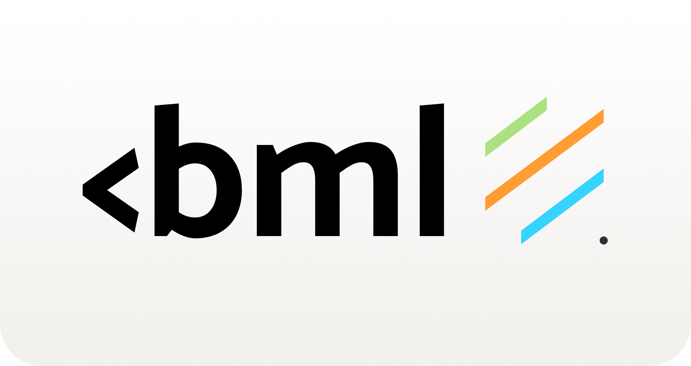

<p>
  <a href="https://github.com/tesseradecade/vbml">
    
  </a>
</p>

<p>
— markup language that compiles to regex.
</p>

</img>
</img>
</img>
</img>

## Features

* Clean regex compiler and parser (the regex core can be easily switched)
* Built-in validators and easy to implement custom ones

```js
"I am <name>, i am <age:int> years old" + "I am Steve, i am 50 years old" = {"name": "Steve", "age": 50}
```

## Installation

Install with pip, poetry or uv:

```shell script
pip install vbml
poetry add vbml
uv add vbml
```

## :book: Documentation

[\*here\*](/docs/index.md)

## Example

```python
from vbml import Patcher, Pattern

patcher = Patcher()
pattern = Pattern("I have <amount:int> apples. They are <adj>")

result1 = patcher.check(pattern, "I have 3 apples. They are green")
result2 = patcher.check(pattern, "I have three apples. They are green")
result3 = patcher.check(pattern, "I have apples")

result1 # {"amount": 3, "adj": "green"}
result2 # None
result3 # None
```
