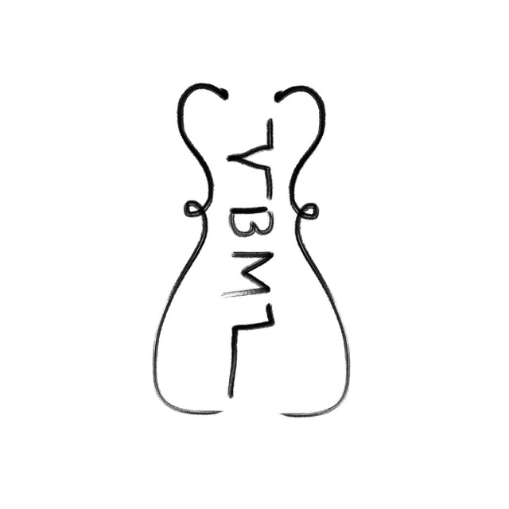

<p align="center">
  <a href="https://github.com/tesseradecade/vbml">
    
  </a>
</p>

<h1>
  vbml
</h1>

<p>
— markup language that compiles to regex.
</p>

<p align="center">
  
  
  
  
</p>

## Features

* Clean `regex`-based parser
* Easy-to-understand validators / Custom validators
* Lots of features out-of-box

`I am <name>, i am <age:int> years old` + `I am Steven, i am 20 years old` = `{"name": "Steven", "age": 20}`

## Installation

Install with pip:

```shell script
pip install vbml
```

Or with poetry:

```shell script
poetry add vbml
```

## Run tests

Clone repo from git:

```shell script
git clone https://github.com/tesseradecade/vbml.git
```

Go to repository and run tests with `poetry`:

```shell script
cd vbml
poetry install
poetry run pytest
```

## :book: Documentation

Full documentation contents are available in [docs/index.md](/docs/index.md)

## Simple example

```python
from vbml import Patcher, Pattern

patcher = Patcher()
pattern = Pattern("I have <amount:int> apples. They are <adj>")

result1 = patcher.check(pattern, "I have 3 apples. They are green")
result2 = patcher.check(pattern, "I have three apples. They are green")
result3 = patcher.check(pattern, "Something irrelevant")

result1 # {"amount": 3, "adj": "green"}
result2 # None
result3 # None
```
